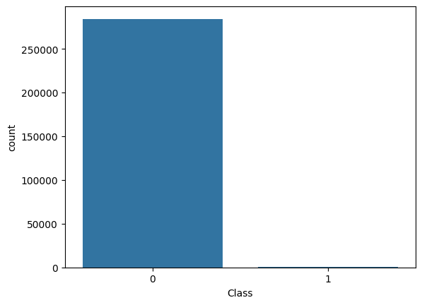
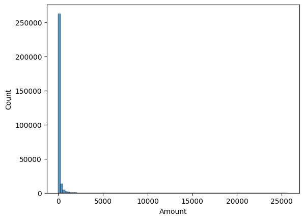
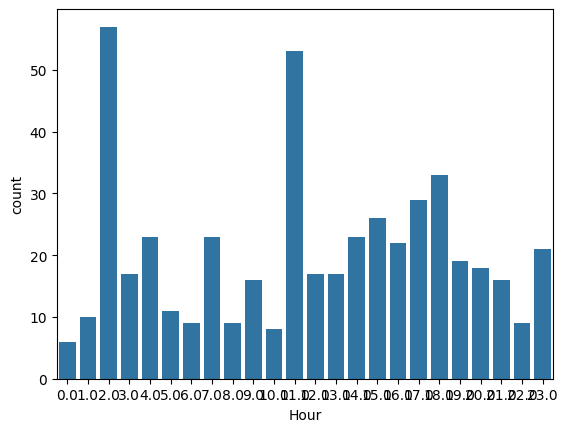
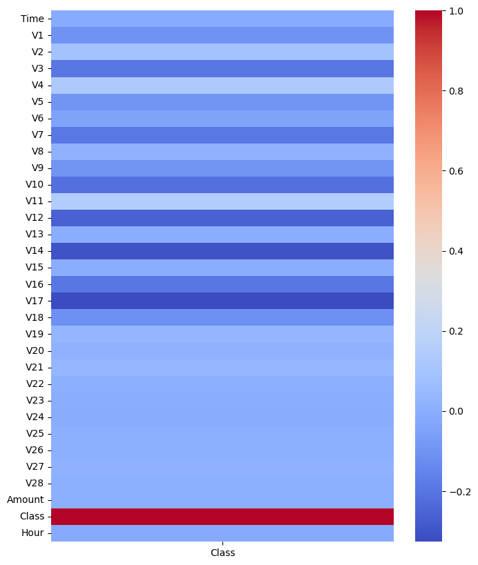

💳 Credit Card Fraud Detection – Exploratory Data Analysis (EDA)
📌 Project Overview

This project analyzes real-world credit card transaction data to uncover patterns in fraudulent transactions.

The dataset contains 284,807 transactions, with only 0.17% labeled as fraud, making it a highly imbalanced dataset — a common real-world challenge in fraud detection.

The goal of this analysis is to:

1.Understand fraud behavior patterns

2.Explore class imbalance

3.Identify important features correlated with fraud

4.Discover time-based fraud patterns

5.Prepare data for future machine learning modeling

📂 Dataset Description:

Dataset: creditcard.csv

Column	Description
1.Time	Seconds elapsed between transaction and first transaction
2.V1 – V28	PCA-transformed anonymized features
3.Amount	Transaction amount
4.Class	Target variable (0 = Normal, 1 = Fraud)

📊 Total Rows: 284,807
📊 Fraud Cases: 492 (~0.17%)
📊 Normal Cases: 284,315 (~99.83%)

🧹 Data Cleaning & Preparation

1.Verified no missing values

2.Checked for duplicates

3.Created a new feature:

4.Hour → extracted from Time

5.Exported cleaned dataset as:

cleaned_data.csv

📊 Exploratory Data Analysis
📌 1️⃣ Class Distribution

Severe class imbalance observed

Fraud transactions represent only 0.17% of total data

📌 2️⃣ Transaction Amount Analysis

Fraud transactions have a higher average transaction amount

Boxplots reveal extreme outliers

Distribution is highly skewed

Average Amount:

Normal → ~$88

Fraud → ~$122

📌 3️⃣ Fraud by Hour Analysis

Created an Hour feature from transaction time.

Key Findings:

Fraud rate peaks around 2 AM (1.71%)

Early morning hours show elevated fraud activity

Daytime hours have relatively lower fraud rates

This indicates time-based fraud behavior patterns.

📌 4️⃣ Correlation Analysis

Analyzed correlation of all features with Class.

Top Positive Correlations:

V11

V4

V2

Top Negative Correlations:

V17

V14

V12

V10

These features may be strong predictors for future ML modeling.

📌 5️⃣ Visualizations Created

1.Class distribution countplot

2.Transaction amount histogram

3.Boxplot of amount by class

4.Fraud rate by hour (line chart)

5.Correlation heatmap

6.Feature correlation ranking

🔍 Key Insights

1.Fraud detection is a highly imbalanced classification problem.

2.Fraud transactions tend to occur more frequently during early morning hours.

3.Certain PCA components (V14, V17, V12) show strong correlation with fraud.

4.Fraud transactions generally involve slightly higher average amounts.

5.Time-based features improve understanding of fraud behavior.

🛠 Technologies Used

Python

Pandas

NumPy

Matplotlib

Seaborn

Jupyter Notebook

📈 Sample Visualizations

👤 Author

Gulam Kazim
Master’s in Computational Science
Data Engineer | Data Analyst

LinkedIn: https://www.linkedin.com/in/gmmk-5bba5125b
